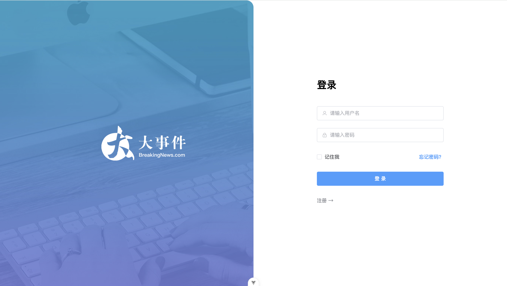

# practice-BigEvent

A full-stack article management system built with Spring Boot and Vue 3.

## Tech Stack

### Backend

- Java 23
- Spring Boot 3
- Spring MVC
- MyBatis
- MySQL
- Redis
- Alibaba Cloud OSS
- JWT
- Hibernate Validator
- PageHelper

### Frontend

- Vue 3
- Vite
- Vue Router
- Pinia
- Axios
- Element Plus
- Vue Quill

---

## Features

### User Module

- ✅ User registration
- ✅ User login (JWT authentication)
- ✅ Get user information
- ✅ Update user profile
- ✅ Update avatar
- ✅ Update password

### Category Management

- ✅ Create category
- ✅ List categories
- ✅ Get category details
- ✅ Update category
- ✅ Delete category

### Article Management

- ✅ Create article
- ✅ Paginated article query
- ✅ Dynamic filtering
- ✅ Rich text editor
- ✅ Image upload
- ✅ Update article
- ✅ Delete article

### File Upload

- ✅ Upload images to Alibaba Cloud OSS
- ✅ Generate unique filenames using UUID
- ✅ Return public image URL

### Authentication & Security

- ✅ JWT authentication
- ✅ Redis-based token validation
- ✅ Automatic token invalidation after password update
- ✅ Login interceptor
- ✅ ThreadLocal user context

### Validation

- ✅ Hibernate Validator
- ✅ Global exception handling
- ✅ Validation groups
- ✅ Custom validation annotation

### Pagination

- ✅ PageHelper integration
- ✅ Generic `PageBean` response

---

## Project Status

### Backend

- ✅ RESTful API completed
- ✅ Database integration
- ✅ Redis integration
- ✅ OSS file upload
- ✅ Authentication & authorization

### Frontend

- ✅ Vue 3 SPA completed
- ✅ User authentication
- ✅ User center
- ✅ Category management
- ✅ Article management
- ✅ Rich text editor
- ✅ Image upload
- ✅ Dynamic routing
- ✅ State management with Pinia
- ✅ Axios request & response interceptors

---

## Current Status

🎉 **Frontend and backend core features have been completed.**

This project now supports a complete article management workflow, including:

- User authentication
- Category management
- Article CRUD
- Rich text editing
- Image upload
- Avatar update
- Password reset

Future improvements may include:

- UI optimization
- Responsive layout
- Unit testing
- Docker deployment
- CI/CD
- Performance optimization

---

## Screenshots

### Login

The login page supports user registration and JWT-based authentication.

### Article Management

Manage articles with pagination, category filtering, rich text editing, image upload, and CRUD operations.

### Category Management

Create, edit, and delete article categories.

### User Profile

Update personal information including nickname and email.

### Avatar Management

Upload and update user avatars through Alibaba Cloud OSS.

### Password Reset

Securely change the account password. Users are required to re-login after a successful password update.

---

## Acknowledgements

This project was completed as part of the Heima Programmer (黑马程序员) Spring Boot & Vue learning course.

The frontend UI layout and project structure are based on the course materials, while the implementation, debugging, integration, and feature completion were completed during the learning process.